# How This Repo Works

A picture book for understanding openshift-virtualization-tests.

## The Big Picture

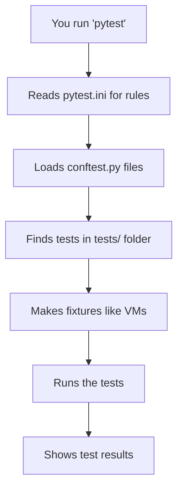

You ask the computer to run tests. It reads the rules, finds the tests, builds the things needed, and runs them to see if they pass.

## Where Things Live

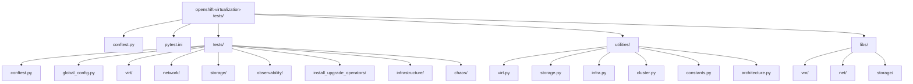

Think of the repository like a house with different rooms. `tests/` is where the tests play, `utilities/` is the toolbox for fixing things, and `libs/` has the blocks to build stuff.

## What is a Fixture?

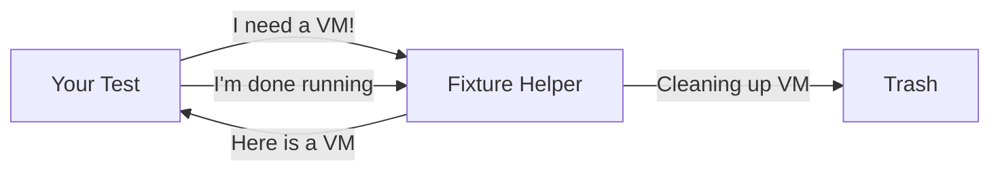

A fixture is a magical helper that makes things for your test and cleans them up after. If your test needs a Virtual Machine (VM) or a namespace, you just ask the fixture, and it gives you one!

```python
def test_my_thing(running_vm):  # ← 'give me a running VM'
    assert running_vm.status == 'Running'  # use it
# pytest handles creation AND cleanup
```

## The Conftest Chain

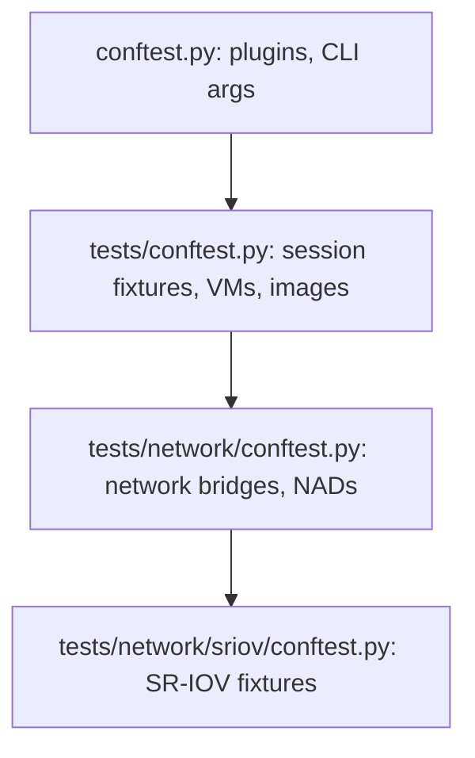

Conftest files are like rulebooks that share fixtures. Big rulebooks at the top share with everyone, and small rulebooks at the bottom only share with specific tests. Inner tests can use fixtures from any rulebook above them.

## Fixture Lifecycle (Scope)

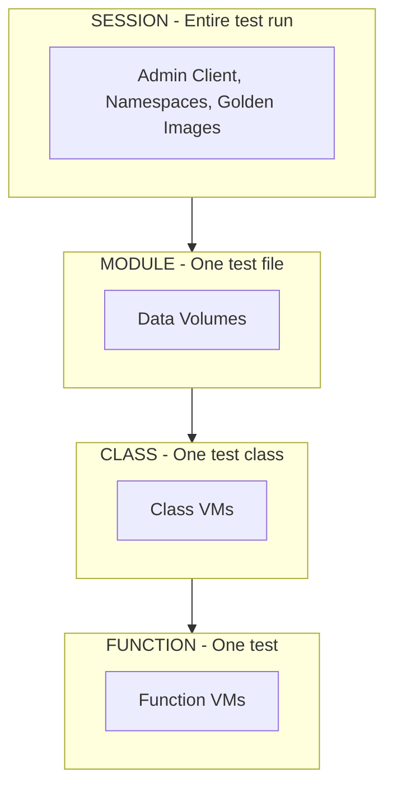

Some fixtures take a long time to build, so we keep them alive for the whole test run (Session). Others are quick, so we make them fresh for every single test (Function) and throw them away right after.

## The Golden Image Pattern

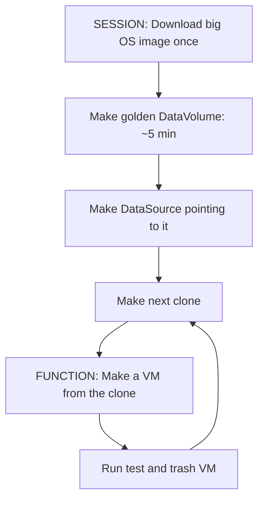

The golden image is like a master photocopy. Instead of downloading an image from scratch for every test, we download it once and make very fast copies (clones) for each test.

## How Architecture Detection Works

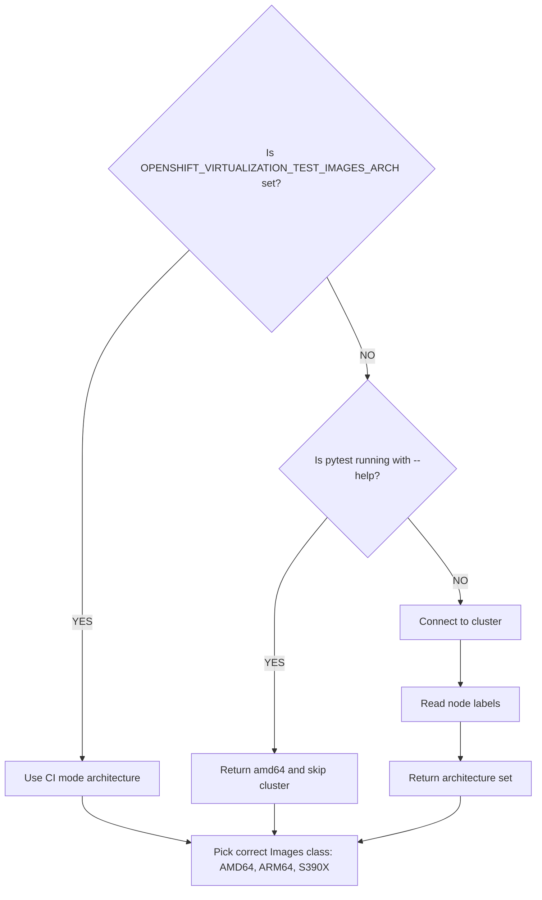

The tests need to know what kind of computer brains (CPU architecture) the cluster uses. It checks settings or looks at the cluster to pick the right container images.

## The Marker System

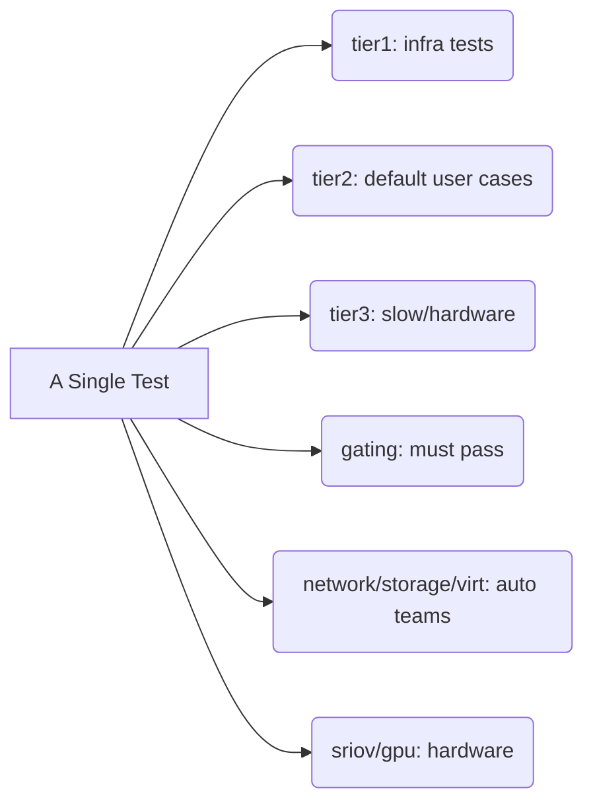

Markers are like tags you put on tests so you can find them later. You can say "Run only the Network tests" or "Run only the quick Tier 1 tests" using these tags.

## Configuration Flow

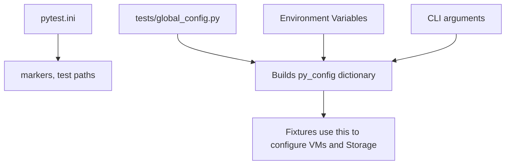

The config flow gathers settings from files, commands, and the environment. It puts them all into one big dictionary so the fixtures know exactly how to build things.

## How Storage Works

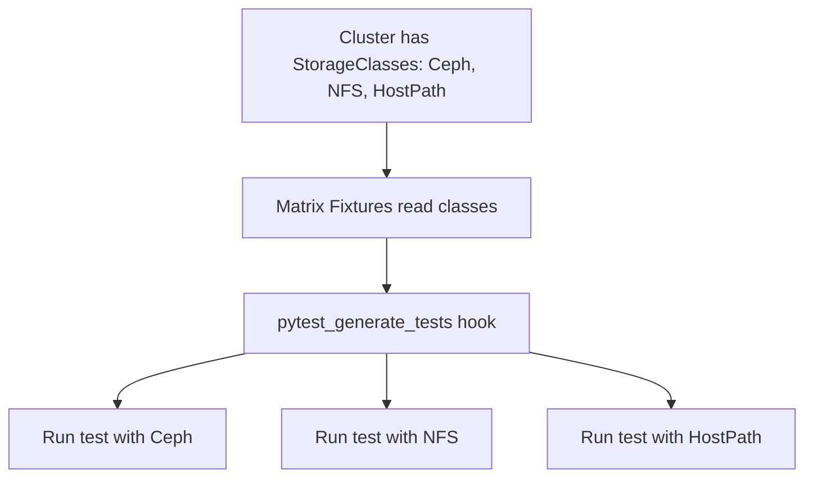

Different clusters save files in different ways using StorageClasses. The tests automatically find what is available and run the same test on every type of storage to make sure they all work.

## Test Domains at a Glance

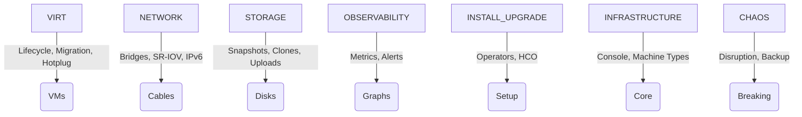

The tests are split into different neighborhoods based on what they do. Virt tests play with virtual machines, Network tests play with cables, and Chaos tests just like breaking things.

## Key Utilities Quick Reference

| File | What it does | Example functions |
|------|-------------|------------------|
| utilities/virt.py | VM operations | VirtualMachineForTests, migrate_vm, wait_for_vm_interfaces |
| utilities/storage.py | Storage operations | data_volume(), create_or_update_data_source() |
| utilities/infra.py | Infrastructure | create_ns(), ExecCommandOnPod, run_command |
| utilities/cluster.py | Cluster ops | cache_admin_client(), get_nodes_by_type |
| utilities/constants.py | All constants | Images, StorageClassNames, timeouts |
| utilities/monitoring.py | Prometheus | get_metric_value(), wait_for_alert |
| utilities/network.py | Network helpers | network operations |
| libs/vm/vm.py | VM builder | VirtualMachineForTests class |
| libs/vm/factory.py | VM factory | create VM specs programmatically |

Helper files are neatly organized so you can quickly find the tools you need. Just grab the right file for the job!
