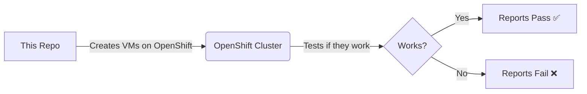
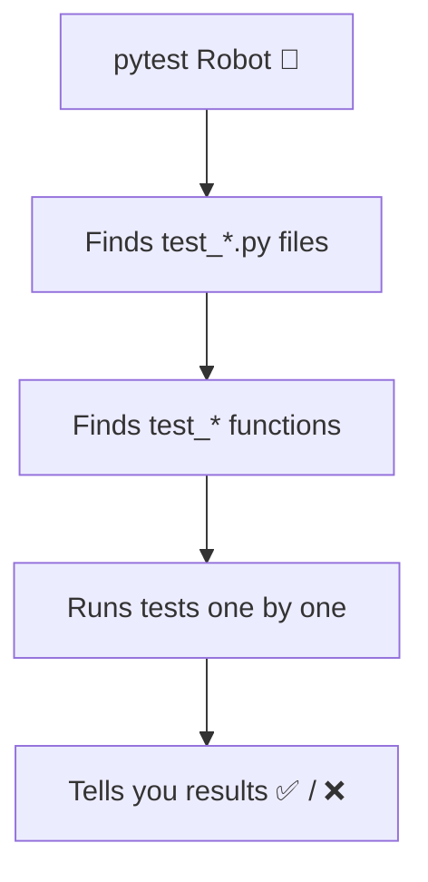
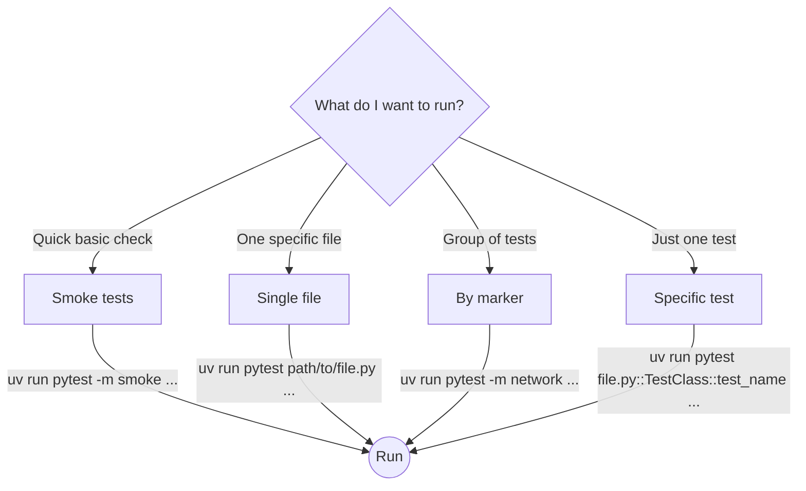
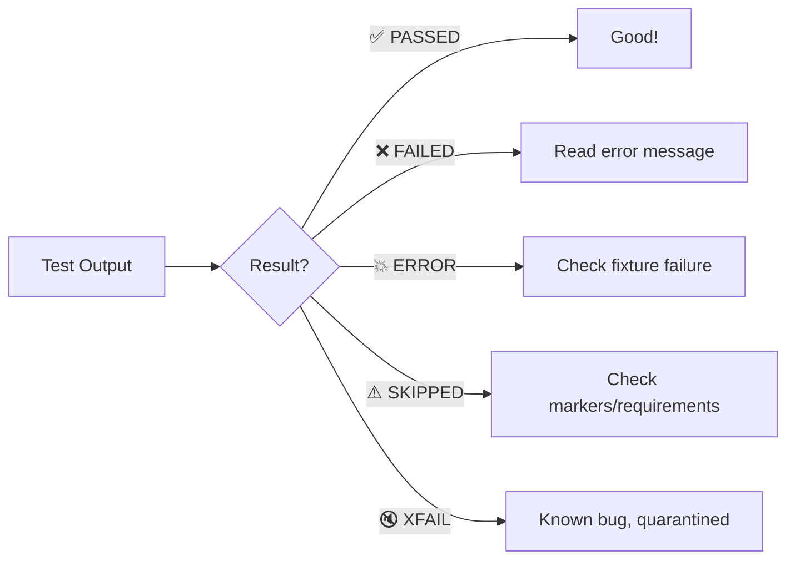

# Welcome to openshift-virtualization-tests 👋

You're new here. This page gets you from zero to running your first test.

## What is This Repo?

This repo tests OpenShift Virtualization (CNV/KubeVirt) — it creates VMs, networks, and storage on OpenShift clusters, then checks if everything works.



## What is pytest?

`pytest` is the tool that runs the tests. Think of it as a robot that:
1. Finds all test files (files starting with `test_`)
2. Finds all test functions (functions starting with `test_`)
3. Runs them one by one
4. Tells you what passed ✅ and what failed ❌



## What You Need

### Prerequisites
- Python 3.14+
- `uv` (Python package manager — like pip but faster)
- Access to an OpenShift cluster with CNV installed
- `oc` CLI logged into the cluster

### Setup

```bash
# Clone the repo
git clone https://github.com/RedHatQE/openshift-virtualization-tests.git
cd openshift-virtualization-tests

# Install dependencies (uv does this automatically on first run)
uv sync
```

## Your First Test Run

### Smoke Tests (Quick Check)
```bash
# Run smoke tests — these are quick and verify basics
uv run pytest -m smoke --tc-file=tests/global_config.py
```

### Run a Single Test File
```bash
uv run pytest tests/virt/cluster/general/test_vm_lifecycle.py --tc-file=tests/global_config.py
```

### Run Tests by Marker
```bash
# Only network tests
uv run pytest -m network --tc-file=tests/global_config.py

# Only tier1 (infrastructure) tests
uv run pytest -m tier1 --tc-file=tests/global_config.py

# Only gating tests (must pass before merge)
uv run pytest -m gating --tc-file=tests/global_config.py
```

### Run a Specific Test
```bash
uv run pytest tests/virt/cluster/general/test_vm_lifecycle.py::TestVMLifecycle::test_start_vm --tc-file=tests/global_config.py
```



## Reading Test Output

- **PASSED**  ✅ = Test worked
- **FAILED**  ❌ = Something broke (read the error message)
- **SKIPPED** ⚠️  = Test was skipped (usually missing hardware/config)
- **ERROR**   💥 = Test couldn't even start (fixture failed)
- **XFAIL**   🔇 = Expected to fail (known bug, quarantined)



## The 5 Things You Need to Know

1. **All tests are in `tests/`** — organized by domain (virt, network, storage...)
2. **`conftest.py` files provide fixtures** — fixtures create things tests need (VMs, namespaces)
3. **`utilities/` has helper functions** — don't reinvent the wheel, check here first
4. **Markers filter what runs** — `-m network` runs only network tests
5. **`uv run pytest`** — ALWAYS use `uv run`, never bare `pytest`

## What to Read Next

| I want to... | Read this |
|---|---|
| Understand the architecture | [How It Works](HOW_IT_WORKS.md) |
| Write a new test | [Writing Tests](WRITING_TESTS.md) |
| Run tests with specific options | [Running Tests](RUNNING_TESTS.md) |
| Know the coding rules | [AGENTS.md](../AGENTS.md) |
