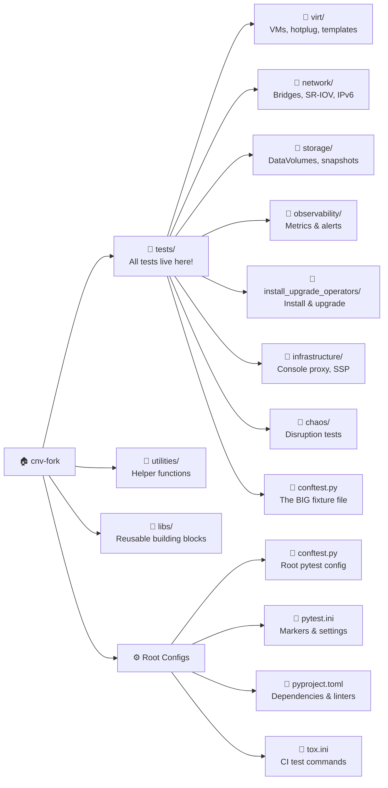
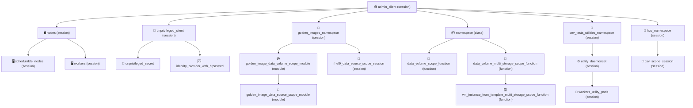
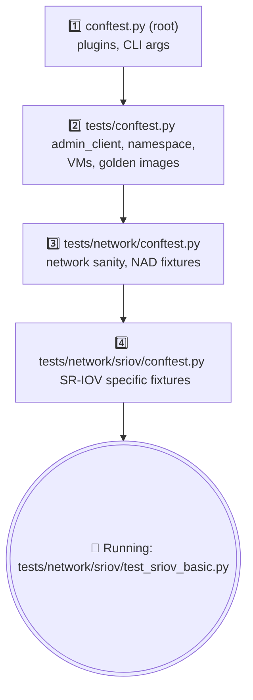
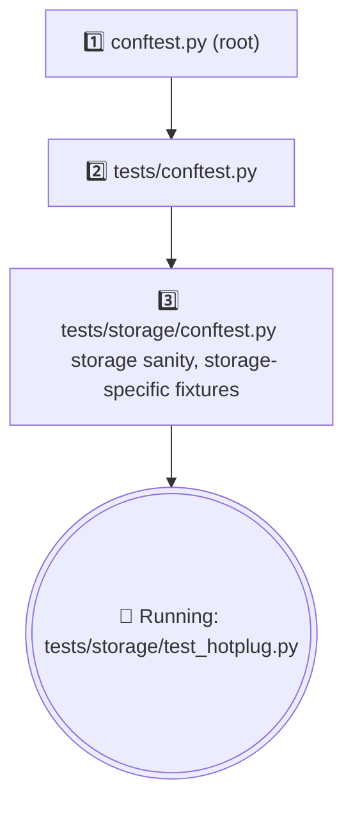

# Repo Map 🗺️

Lost? This page tells you exactly where everything is in our code house. Think of it as a picture book to find what you need! 🎈

## The Map

Here is the big picture of where files and folders live.

---

## I Need To... 👉 Look Here

When you want to do something, just look it up in this magic table!

| I need to... | Look in |
|---|---|
| Find a test for feature X | `tests/<domain>/<feature>/` |
| Find a fixture that creates a VM | `tests/conftest.py` (search for `vm_instance`) |
| Find a fixture that creates storage | `tests/conftest.py` (search for `data_volume`) |
| Find a fixture that creates a namespace | `tests/conftest.py` (search for `namespace`) |
| Find a network-specific fixture | `tests/network/conftest.py` |
| Find a storage-specific fixture | `tests/storage/conftest.py` |
| Find a virt-specific fixture | `tests/virt/conftest.py` |
| Write a VM helper function | `utilities/virt.py` |
| Write a storage helper | `utilities/storage.py` |
| Write a network helper | `utilities/network.py` or `utilities/infra.py` |
| Write a cluster helper | `utilities/cluster.py` |
| Find constants (images, timeouts) | `utilities/constants.py` |
| Find pytest markers | `pytest.ini` |
| Change CI commands | `tox.ini` |
| Change linter rules | `pyproject.toml` and `.flake8` |
| Change container image | `Dockerfile` |
| See coding rules | `AGENTS.md` |
| Check test run instructions | `docs/RUNNING_TESTS.md` |

---

## The Fixture Dependency Tree 🌳

Fixtures are helpers that build things for your test. Many fixtures build on top of other fixtures!

**What do the arrows mean?**
Arrows mean *depends on*. If you ask for the VM at the bottom (`vm_instance_from_template...`), pytest will automatically create the storage (`data_volume...`), the namespace (`namespace`), and the client (`admin_client`) above it!

---

## The conftest.py Chain 🔗

When you run a test, Pytest walks down the folder tree and picks up tools (`conftest.py` files) along the way.

**Example 1: Running a Network Test**

**Example 2: Running a Storage Test**

💡 **Key insight:** You get ALL fixtures from parent `conftest.py` files automatically!

---

## Files That Matter 🌟

These are the most important files in the whole repo. If you know these, you know everything.

| File | Lines | What it does |
|---|---|---|
| `tests/conftest.py` | ~2800 | The mother of all fixtures. Makes VMs, namespaces, clients. |
| `utilities/constants.py` | ~900 | Every constant, image path, and timeout lives here. |
| `utilities/virt.py` | ~800 | VM helper functions (start, stop, migrate). |
| `utilities/storage.py` | ~600 | Storage helper functions (disks, PVCs). |
| `utilities/infra.py` | ~500 | Infrastructure helpers (nodes, pods, SSH). |
| `tests/global_config.py` | ~200 | Cluster configuration that gets loaded at startup. |
| `pytest.ini` | ~110 | All custom markers (`@pytest.mark...`) are defined here. |
| `conftest.py` (root) | ~800 | Pytest hooks and plugins. Handles test setup logic. |
