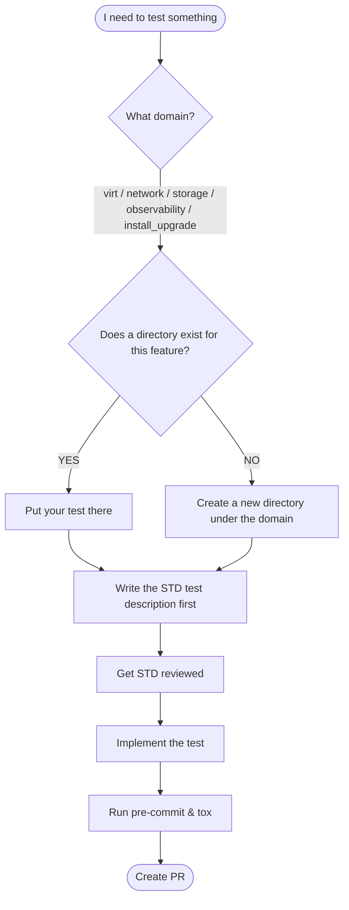
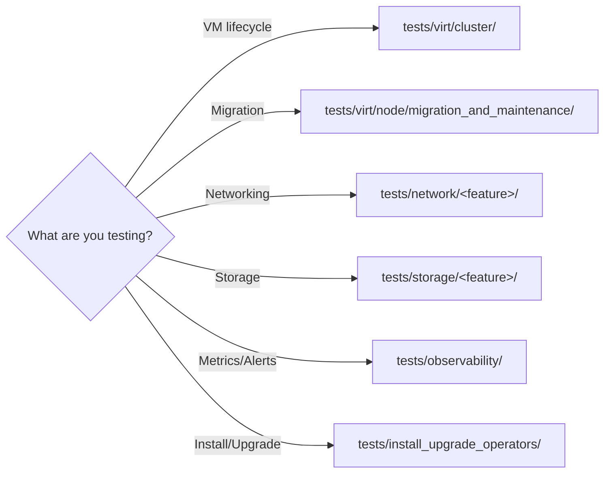
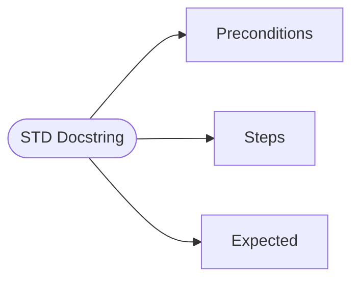
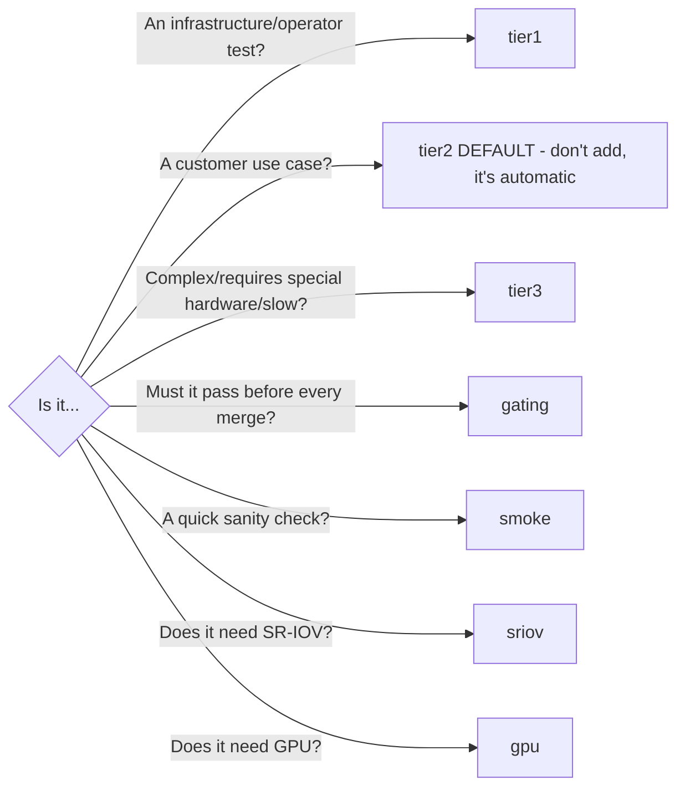

# Writing Tests

A step-by-step guide. Follow the arrows.

## The Big Flowchart



## Step 1: Where Does My Test Go?



**Rule**: One feature = one directory. Test file = `test_<functionality>.py`

## Step 2: Write the Test Description (STD) First

Before writing code, write the docstring. This is called an STD.

```python
__test__ = False  # ← This tells pytest 'don't run this yet'


class TestMyFeature:
    '''STP: https://link-to-test-plan

    Preconditions:
        - A running VM with Fedora OS
    '''

    def test_feature_works(self):
        '''Test that feature X does Y.

        Preconditions:
            - A running VM with Fedora OS
        Steps:
            1. Do something to the VM
            2. Check the result
        Expected:
            The result is correct.
        '''
```



## Step 3: Pick Your Markers



**Rule**: Don't add team markers (network, storage, virt) — they're automatic based on directory.

## Step 4: Use Existing Fixtures

DON'T create VMs from scratch. Use existing fixtures.

| I need... | Use this fixture | Scope |
|---|---|---|
| A Kubernetes client | `admin_client` | session |
| An unprivileged client | `unprivileged_client` | session |
| A namespace | `namespace` | class/module |
| A running Fedora VM | `vm_instance_from_template_*` | varies |
| A DataVolume | `data_volume_scope_*` | varies |
| A golden image | `golden_image_data_source_*` | varies |
| Cluster nodes | `nodes`, `schedulable_nodes`, `workers` | session |

### Fixture naming convention:
- `*_scope_session` → lives for entire test run
- `*_scope_module` → lives for one test file
- `*_scope_class` → lives for one test class
- `*_scope_function` or no suffix → lives for one test

## Step 5: The Test Template

Copy-paste starter template:

```python
import logging
import pytest
from utilities.constants import Images

LOGGER = logging.getLogger(__name__)


@pytest.mark.usefixtures('namespace')
class TestMyFeature:
    '''STP: https://link-to-test-plan

    Preconditions:
        - A running VM with Fedora OS
    '''

    @pytest.mark.polarion('CNV-12345')
    def test_something_works(
        self,
        vm_instance_from_template_multi_storage_scope_function,
    ):
        '''Test that something works.

        Preconditions:
            - A running VM with Fedora OS
        Steps:
            1. Do something
        Expected:
            It works.
        '''
        vm = vm_instance_from_template_multi_storage_scope_function
        LOGGER.info(f'Testing something on VM {vm.name}')
        # Your test logic here
        assert vm.ready, f'VM {vm.name} is not ready'
```

## Step 6: Write a Fixture (When You Must)

Only write a new fixture when nothing existing works.

**Rules:**
1. Fixtures go in `conftest.py`
2. Name = NOUN (what it provides): `running_vm`, NOT `create_vm`
3. Use yield + cleanup
4. Return the thing you created

```python
@pytest.fixture(scope='class')
def my_special_vm(namespace, unprivileged_client):
    with VirtualMachineForTests(
        name='special-vm',
        namespace=namespace.name,
        client=unprivileged_client,
    ) as vm:
        vm.start(wait=True)
        yield vm
    # cleanup happens automatically (context manager)
```


## Step 7: Before You Push

```bash
# Check formatting and lint
pre-commit run --all-files

# Run all CI checks
tox

# Run unit tests
tox -e utilities-unittests
```


## Common Mistakes

| ❌ Wrong | ✅ Right |
|---|---|
| `pytest tests/...` | `uv run pytest tests/...` |
| `import subprocess` | `from pyhelper_utils.shell import run_command` |
| `time.sleep(30)` | `TimeoutSampler(wait_timeout=30, ...)` |
| `def create_vm()` (fixture) | `def running_vm()` (noun!) |
| Adding `@pytest.mark.network` | Don't — it's automatic |
| Skipping STD review | Write STD first, review, then implement |
| `# noqa` to suppress linter | Fix the actual issue |
