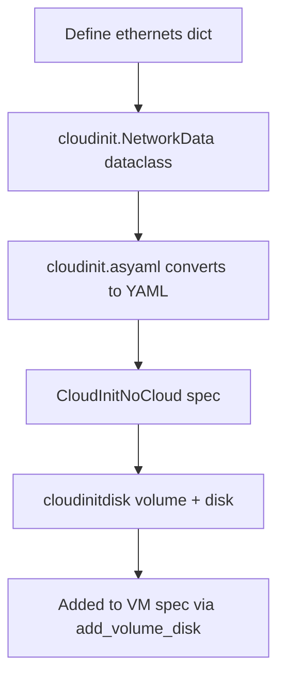
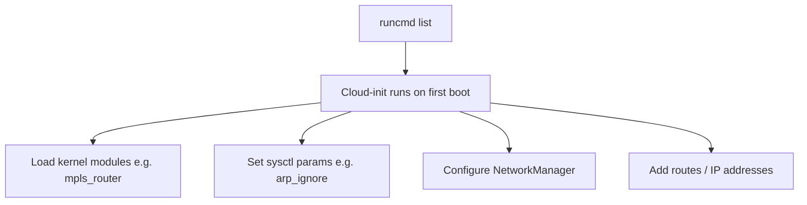

# Cloud-Init Network Configuration

VMs receive their network configuration through cloud-init. This is how guest-side IPs, routes, and commands are configured.

## Network Data Flow



## Static IP Assignment

```yaml
ethernets:
  eth1:
    addresses:
      - "10.200.0.1/24"
```

Used for Linux bridge and localnet secondary interfaces where DHCP is not available.

## Dual-Stack Configuration

```yaml
ethernets:
  eth0:
    addresses:
      - "fd10:0:2::2/120"
    gateway6: "fd10:0:2::1"
    dhcp4: true
    dhcp6: false
```

## MAC-Matched (SR-IOV)

```yaml
ethernets:
  "1":
    match:
      macaddress: "02:00:b5:b5:b5:01"
    addresses:
      - "10.200.0.1/24"
```

SR-IOV interfaces use MAC matching because device names are unpredictable.

## User Data (runcmd)



Common runcmd patterns:
- **ARP isolation**: `sysctl -w net.ipv4.conf.all.arp_ignore=1` — prevents cross-interface ARP responses
- **NetworkManager unmanage**: prevents NM from overriding manual IP config
- **Module loading**: `modprobe mpls_router` for MPLS testing

## Cloud-Init Helpers

| Utility | Purpose |
|---------|---------|
| `compose_cloud_init_data_dict(network_data=...)` | Build cloud-init dict with network data |
| `prepare_cloud_init_user_data(section, data)` | Build user-data section |
| `cloudinit.NetworkData(ethernets=...)` | Dataclass for network config |
| `cloudinit.asyaml(no_cloud=...)` | Convert dataclass to YAML string |
| `cloudinit.format_cloud_config(userdata=...)` | Format user-data as cloud-config |
| `cloud_init_network_data(data=...)` | Legacy dict-based network data |
