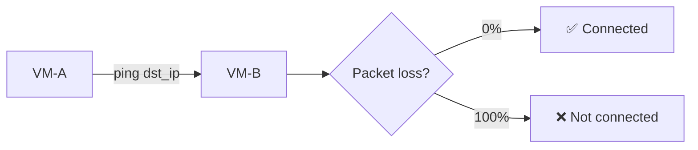
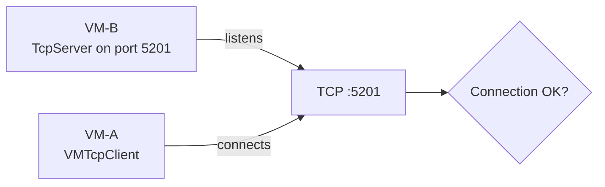
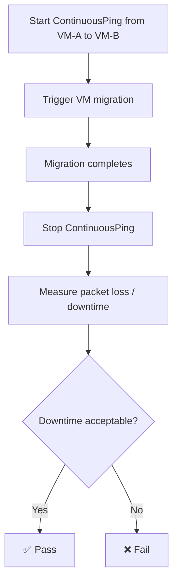

# Connectivity Testing Patterns

All network tests ultimately verify connectivity between VMs. Several patterns exist depending on what's being tested.

## Ping (Point-in-Time)



**Utilities:**
- `utilities.network.assert_ping_successful(src_vm, dst_ip)` — assert ping works
- `utilities.network.ping(src_vm, dst_ip, count)` — returns packet loss count

## TCP (iperf3)



**Utilities:**
- `libs.net.traffic_generator.TcpServer` — starts iperf3 server
- `libs.net.traffic_generator.VMTcpClient` — connects from client VM
- `poll_tcp_connectivity(client_vm, server_vm, server_ip)` — polls until expected state

## Continuous Ping (Migration Stuntime)



Used to measure network downtime during live migration. The `ContinuousPing` runs in background, migration happens, then results are checked.

## Negative Testing

Some tests verify that connectivity does NOT exist (network isolation, policy enforcement):

```python
poll_tcp_connectivity(client_vm, server_vm, server_ip, expect_connectivity=False)
```
