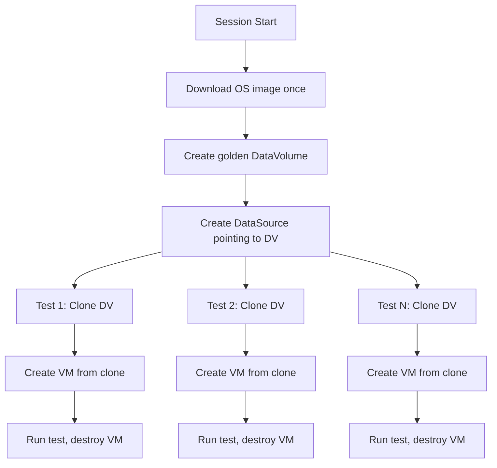
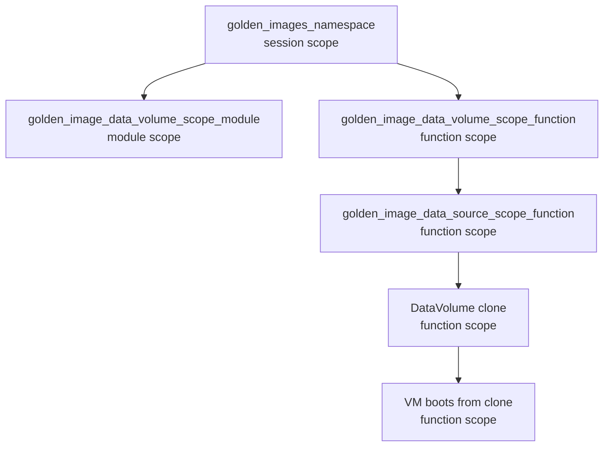

# Golden Image Pattern

> **Repo-wide pattern.** Used across all test domains:
> `tests/virt/`, `tests/storage/`, `tests/network/`, `tests/infrastructure/`, `tests/install_upgrade_operators/`

The golden image pattern is the foundational approach for VM creation in this repository. It avoids downloading a full OS image for every test. One image is downloaded once per session, then cloned rapidly for each test.

## Resource Lifecycle

## Fixture Chain

1. **`golden_images_namespace`** (session scope) — creates a dedicated namespace for golden images, shared across the entire test session.
2. **`golden_image_data_volume_scope_module`** or **`golden_image_data_volume_scope_function`** — creates a DataVolume from a golden image (selected by OS template + storage class).
3. **`golden_image_data_source_scope_function`** — creates a DataSource pointing to the DataVolume.
4. **Tests** use the DataSource to create VMs via `VirtualMachineForTestsFromTemplate`, which clones the DataVolume and boots a VM from it.

## Why This Matters

- **Without golden image**: Each test downloads a full OS image
- **With golden image**: One download, then fast clones — orders of magnitude faster
- Clone uses CSI volume cloning (copy-on-write when storage supports it)
