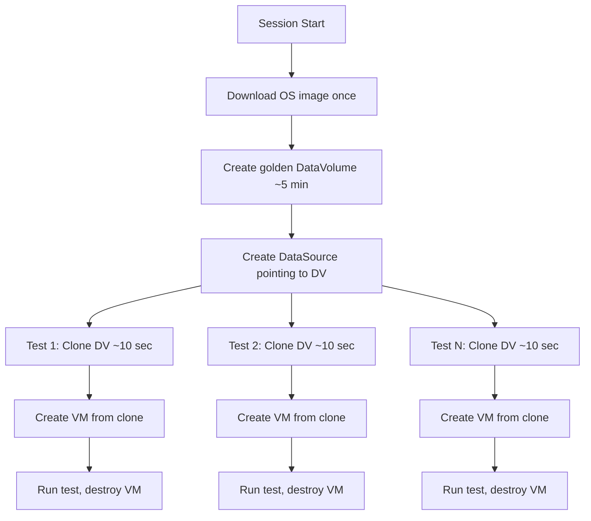
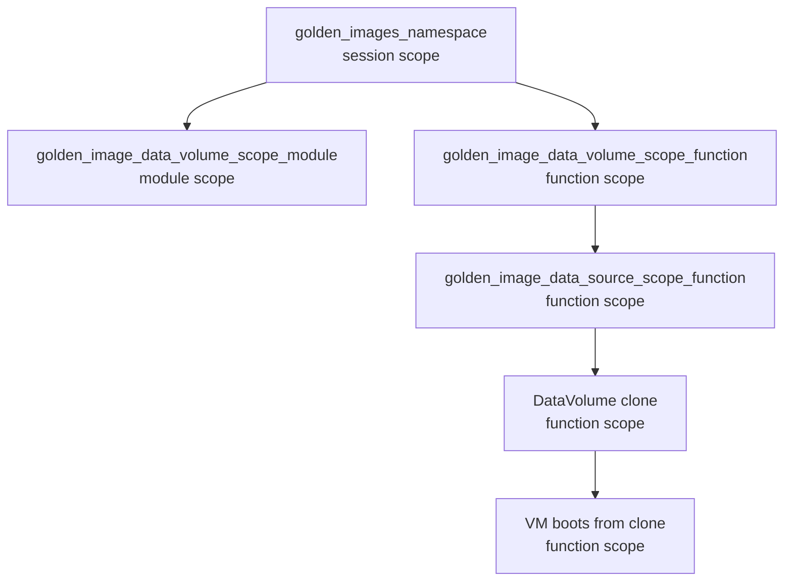

# Golden Image Pattern

The golden image pattern avoids downloading a full OS image for every test. One image is downloaded once per session, then cloned rapidly for each test.

## Resource Lifecycle

## Why This Matters

- **Without golden image**: Each test downloads ~1GB image → 5+ min per test
- **With golden image**: One download, then ~10 sec clones → orders of magnitude faster
- Clone uses CSI volume cloning (copy-on-write when storage supports it)
