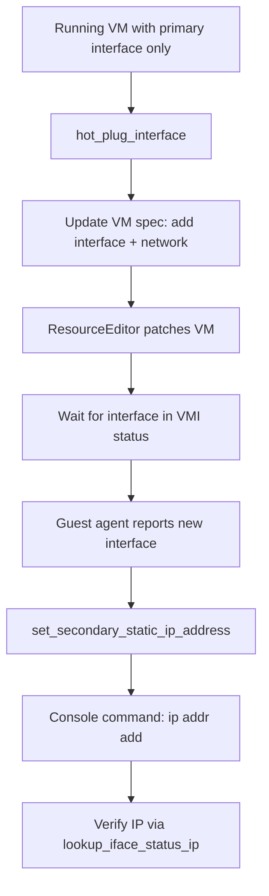
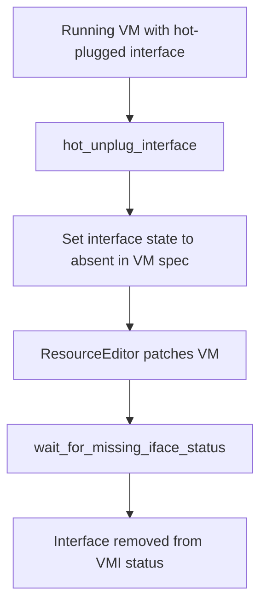
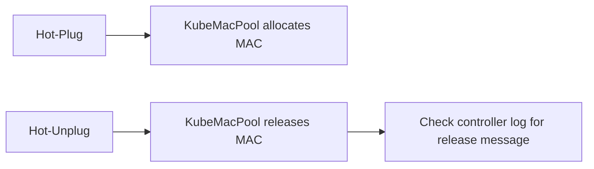

# NIC Hot-Plug Flow

Hot-plug adds or removes network interfaces to a running VM without reboot.

## Hot-Plug (Add Interface)

## Hot-Unplug (Remove Interface)

## MAC Pool Integration

When KubeMacPool is enabled, hot-plug/unplug triggers MAC allocation/release:

