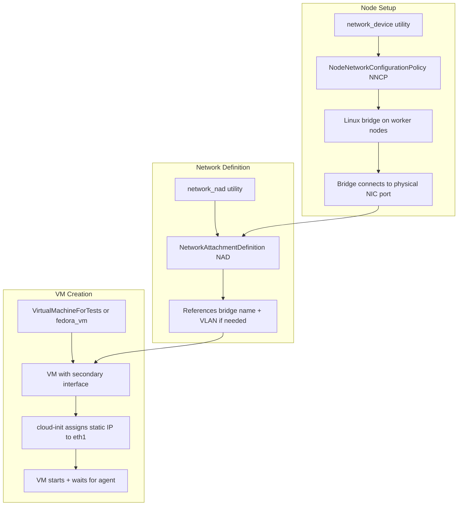
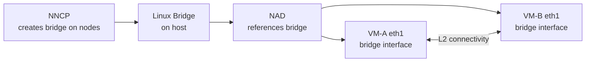
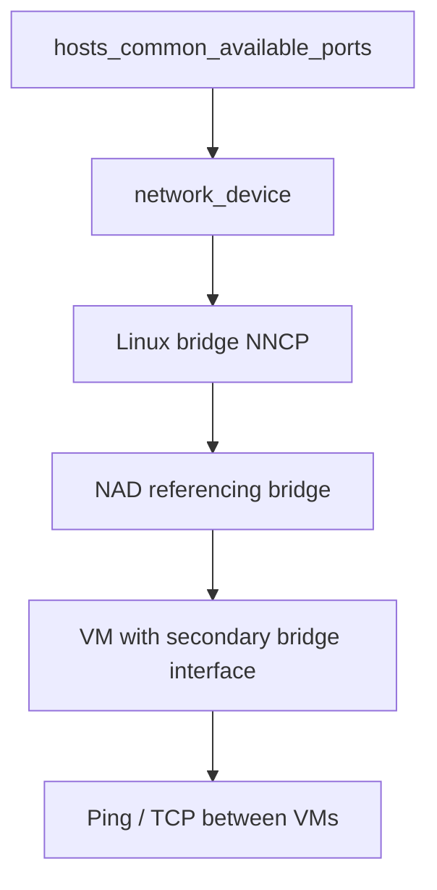
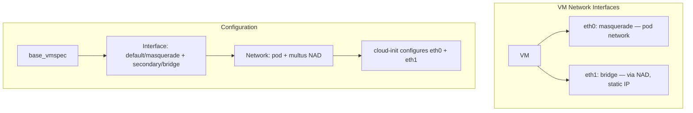

# Linux Bridge Flow

This is the most common secondary network pattern. A Linux bridge is created on the host nodes, then a NAD (NetworkAttachmentDefinition) references it, and VMs attach to it.

## Resource Chain

## Typical Fixture Stack

## Primary + Secondary Topology

The dominant VM pattern uses **masquerade** for the primary (pod network) interface and a **bridge** for the secondary interface. This is the `secondary_network_vm()` helper in `tests/network/l2_bridge/libl2bridge.py`.

- **eth0** (masquerade): Provides default pod network connectivity.
- **eth1** (bridge): Attaches to the Linux bridge via a NAD. Cloud-init assigns a static CIDR address.
- Cloud-init renders both interfaces via `cloudinit.NetworkData(ethernets={...})`.

## VLAN Support

When VLAN tagging is needed, the NAD includes a VLAN ID. The bridge carries tagged traffic and the VM sees untagged frames on its interface.
