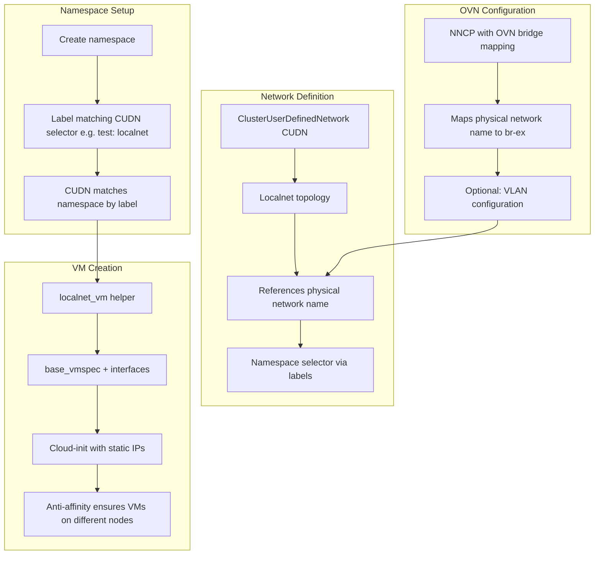
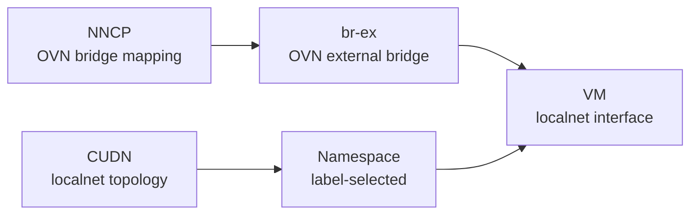

# Localnet Flow

Localnet connects VMs to physical networks through OVN's external bridge (`br-ex`). Unlike Linux bridge, it uses OVN bridge mappings instead of a separate bridge device.

## Resource Chain

## Key Differences from Linux Bridge

| Aspect | Linux Bridge | Localnet |
|--------|-------------|----------|
| Bridge type | Linux bridge (host) | OVN br-ex |
| Network definition | NAD | ClusterUserDefinedNetwork (CUDN) |
| Namespace coupling | NAD in namespace | CUDN selects namespaces by custom labels e.g. `test: localnet` |
| VLAN config | On NAD | On CUDN (access mode) |
| Node config | NNCP creates bridge | NNCP maps physical net to br-ex |
| IPAM | Manual (cloud-init) | Optional (CUDN can disable or enable) |
