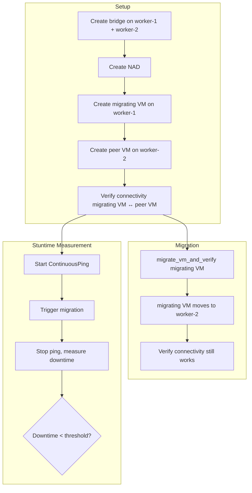
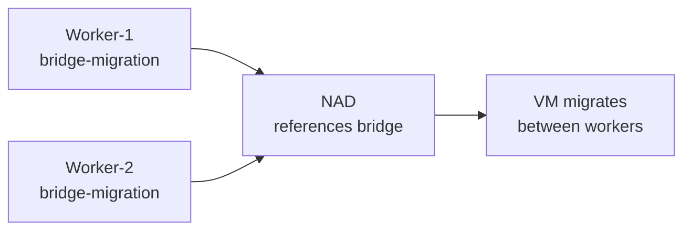

# Network Migration Testing Flow

Migration tests verify that VM network connectivity survives live migration to a different node.

## Bridge Must Exist on Both Nodes

The bridge NNCP must target all worker nodes (not just one), otherwise migration fails because the destination node has no matching bridge.

## Key Utilities

- `migrate_vm_and_verify(vm)` — triggers migration and waits for completion
- `assert_ping_successful(src_vm, dst_ip)` — verifies connectivity post-migration
- `ContinuousPing` — measures downtime during migration

## Other Migration Variants

Migration testing is not limited to Linux bridge networks. The same `ContinuousPing` / stuntime measurement pattern is reused across network types:

- **Localnet migration** — `tests/network/localnet/migration_stuntime/` validates that VMs on localnet (OVN) networks maintain connectivity through live migration, using the same downtime-threshold approach.
