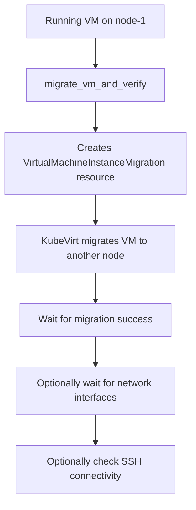
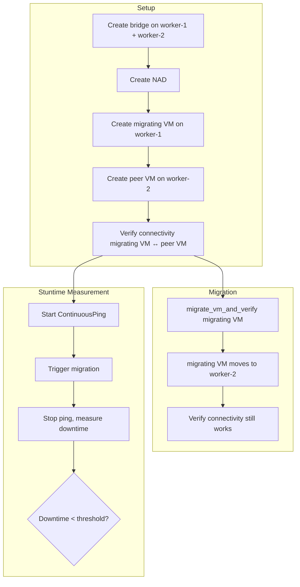
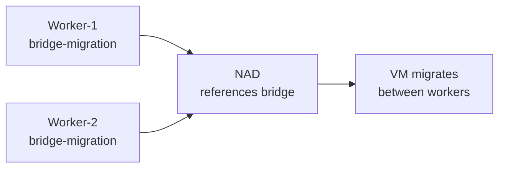

# VM Live Migration

Migration tests verify that a VM can be live-migrated to a different node while preserving state, storage, and (optionally) network connectivity.

> **Repo-wide pattern.** Migration is tested across:
> `tests/virt/node/migration_and_maintenance/`, `tests/storage/`, `tests/network/migration/`, `tests/infrastructure/`

## Key Utility

`migrate_vm_and_verify(vm)` from `utilities/virt.py`:
- Creates a `VirtualMachineInstanceMigration` resource
- Waits for migration to complete
- Optionally verifies network interfaces and SSH
- Returns the migration resource for further assertions

## Migration with Connectivity Verification (Network)

Network migration tests add connectivity checks to prove that VM networking survives live migration.

### Bridge Must Exist on Both Nodes

The bridge NNCP must target all worker nodes (not just one), otherwise migration fails because the destination node has no matching bridge.

### Key Network Utilities

- `migrate_vm_and_verify(vm)` — triggers migration and waits for completion
- `assert_ping_successful(src_vm, dst_ip)` — verifies connectivity post-migration
- `ContinuousPing` — measures downtime during migration

## Migration Variants

| Variant | Test location |
|---|---|
| **Post-copy migration** | `tests/virt/node/migration_and_maintenance/test_post_copy_migration.py` |
| **Storage migration** | `tests/storage/storage_migration/` |
| **Cross-cluster live migration** | `tests/storage/cross_cluster_live_migration/` |
| **Migration during disk/memory load** | `tests/virt/node/migration_and_maintenance/` |
| **Network migration stuntime** | `tests/network/*/migration_stuntime/` |
| **Localnet migration** | `tests/network/localnet/migration_stuntime/` |
