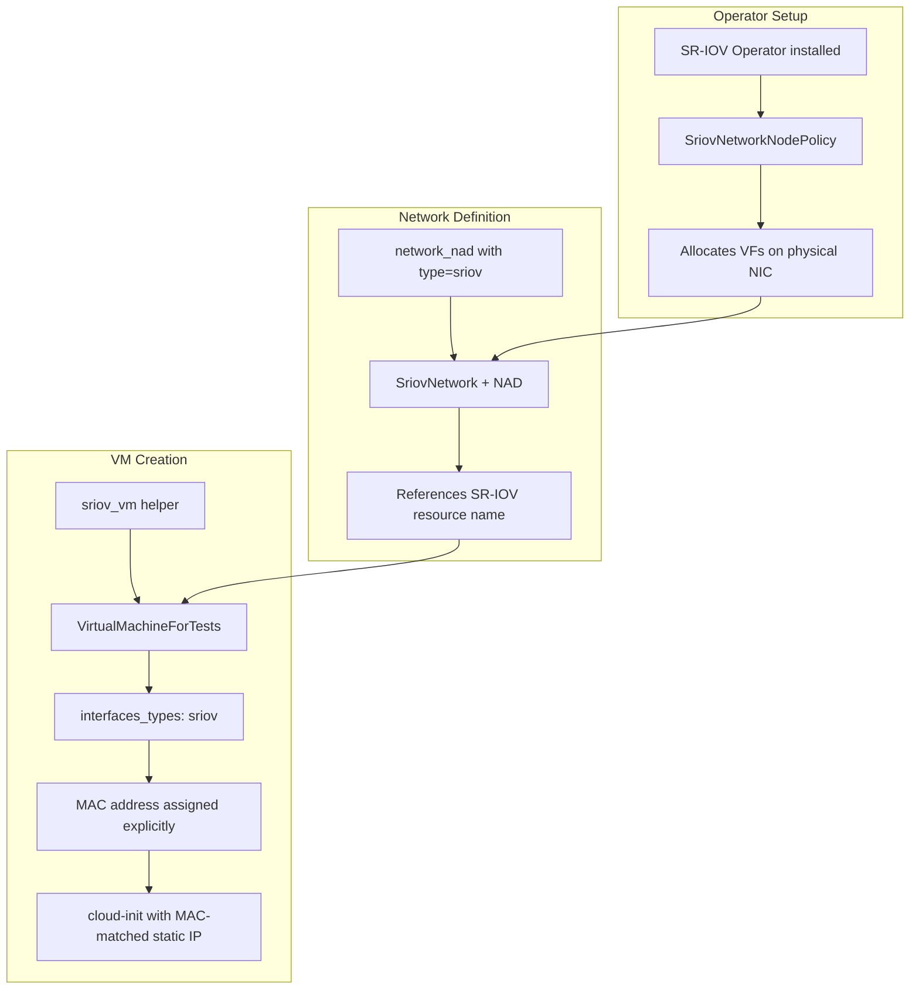
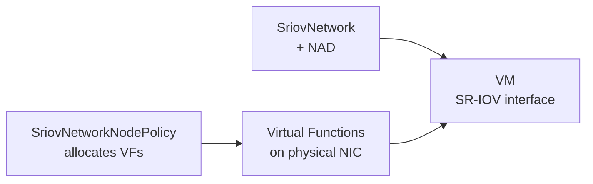

# SR-IOV Flow

SR-IOV (Single Root I/O Virtualization) passes a physical NIC's virtual function (VF) directly to the VM, bypassing the host network stack for high performance.



## Resource Chain



## Key Pattern: MAC-Based Cloud-Init

SR-IOV VMs use explicit MAC addresses and match them in cloud-init network data:

```yaml
ethernets:
  "1":
    match:
      macaddress: "02:00:b5:b5:b5:01"
    addresses: ["10.200.0.1/24"]
```

This ensures the correct interface gets the correct IP regardless of device naming.
