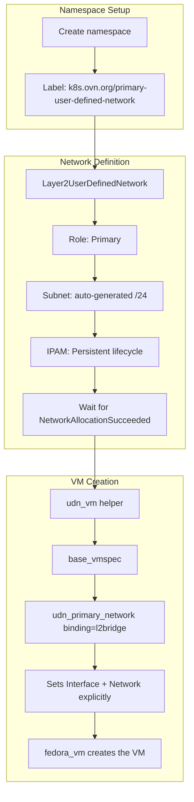
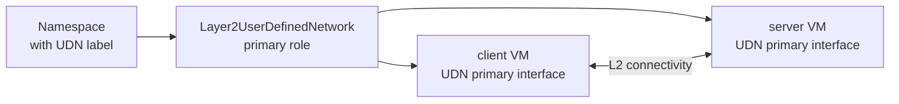

# User Defined Network (UDN) Flow

UDN provides a **primary** network for VMs using OVN-Kubernetes L2 bridge plugin. Unlike secondary networks (Linux bridge, localnet), UDN replaces the default pod network.



## Resource Chain



## VM Network Configuration

The `udn_vm()` helper in `tests/network/libs/vm_factory.py` explicitly configures the UDN interface:

1. Creates a `base_vmspec()`
2. Calls `udn_primary_network(name="udn-primary", binding=binding)` → returns `(Interface, Network)`
3. Sets `spec.template.spec.domain.devices.interfaces = [iface]`
4. Sets `spec.template.spec.networks = [network]`
5. Creates the VM via `fedora_vm()`

The `binding` parameter controls the network binding:
- `"l2bridge"` — the default for most UDN tests
- `"passt"` — used for passt-binding variant tests

> **Note:** The namespace must carry the label `k8s.ovn.org/primary-user-defined-network: ""` (set via `create_udn_namespace()`).

## Affinity Patterns

UDN tests commonly use anti-affinity to ensure VMs land on different nodes, validating cross-node L2 connectivity. Template labels are passed to `udn_vm()`, which uses the first label as the anti-affinity key:

```python
template_labels = {"udn-test": "true"}
vm = udn_vm(..., template_labels=template_labels)
```
