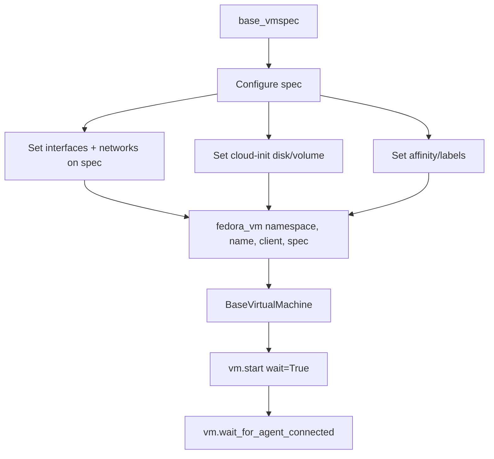
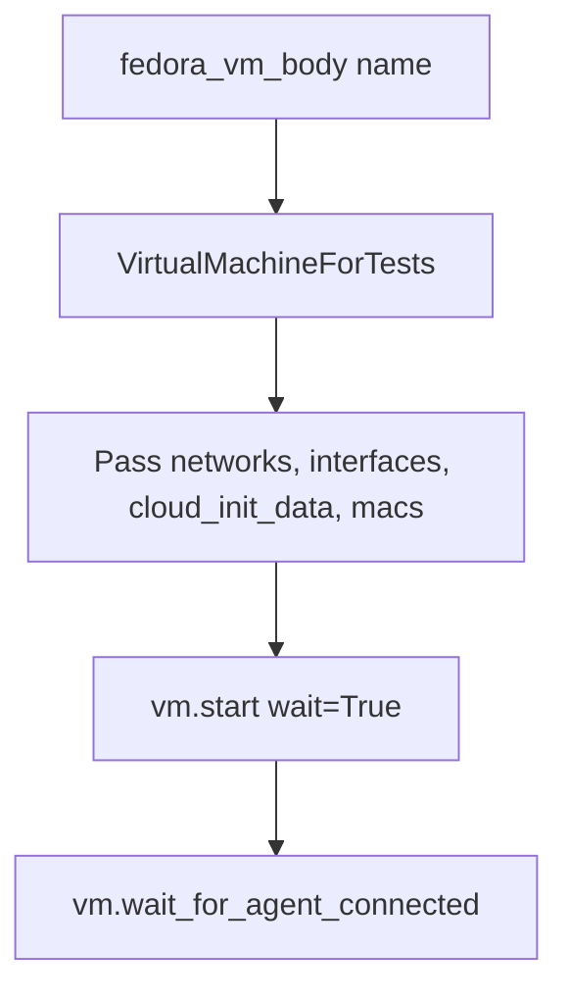

# VM Creation Flows

Two approaches exist:

## Modern Factory (`libs/vm/factory`)

Used in: localnet, UDN, l2_bridge (newer), primary_network

Key pattern:
- `base_vmspec()` creates an empty `VMSpec` dataclass
- Modify `spec.template.spec.domain.devices.interfaces` and `spec.template.spec.networks`
- `fedora_vm()` adds container disk, CPU, memory defaults
- Returns `BaseVirtualMachine` (subclass of ocp_resources VirtualMachine)

## Legacy Pattern (`utilities/virt`)

Used in: sriov, migration, bond, macspoof, nmstate, kubemacpool

Key pattern:
- `fedora_vm_body(name)` generates a dict-based VM body
- `VirtualMachineForTests` wraps it with networks/interfaces as constructor args
- Interfaces specified as dict keys, interface types via `interfaces_types` param

## Choosing Between Them

- **New tests**: Use the modern factory (`base_vmspec` + `fedora_vm`)
- **Existing tests**: May still use legacy pattern — both work
- The modern factory uses Python dataclasses (`VMSpec`, `Interface`, `Network`) instead of raw dicts
