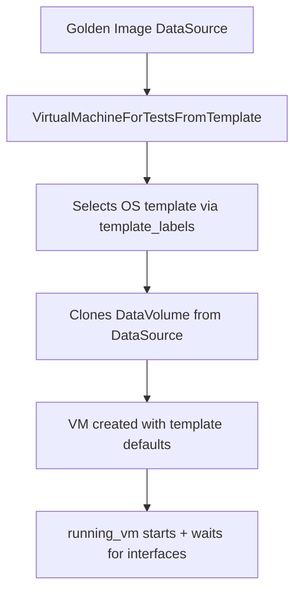
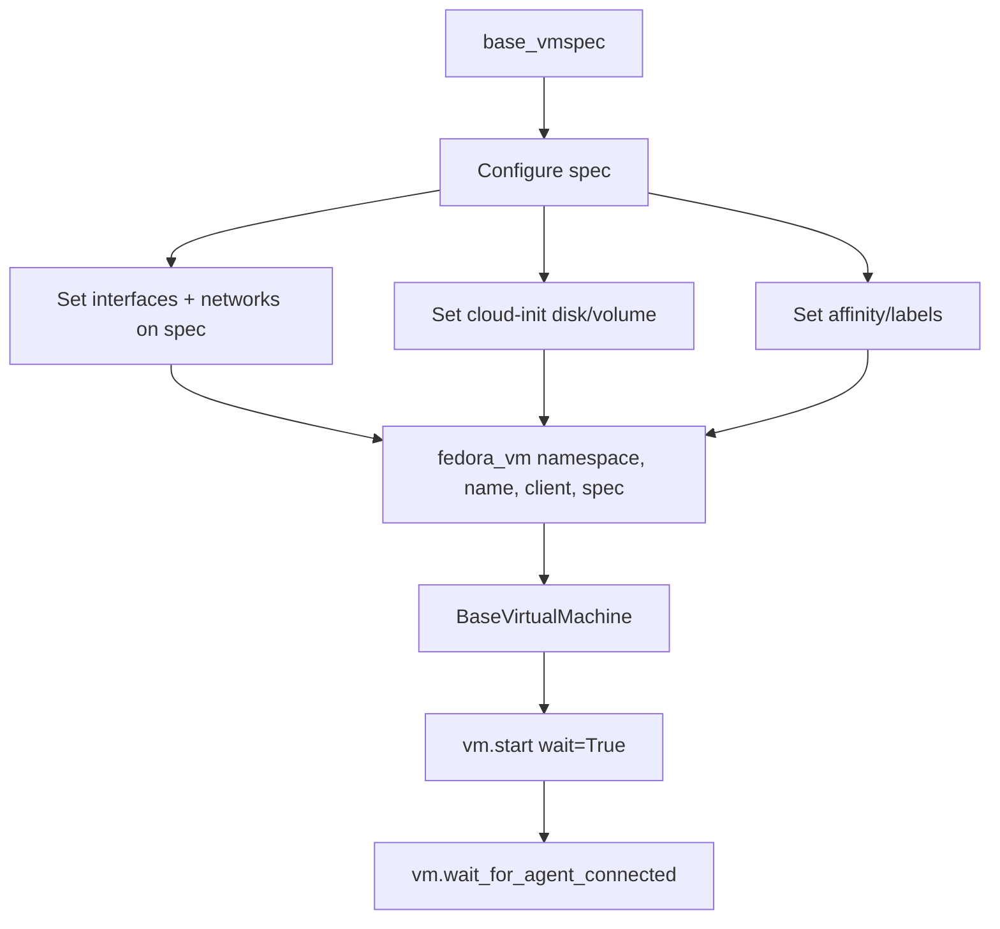
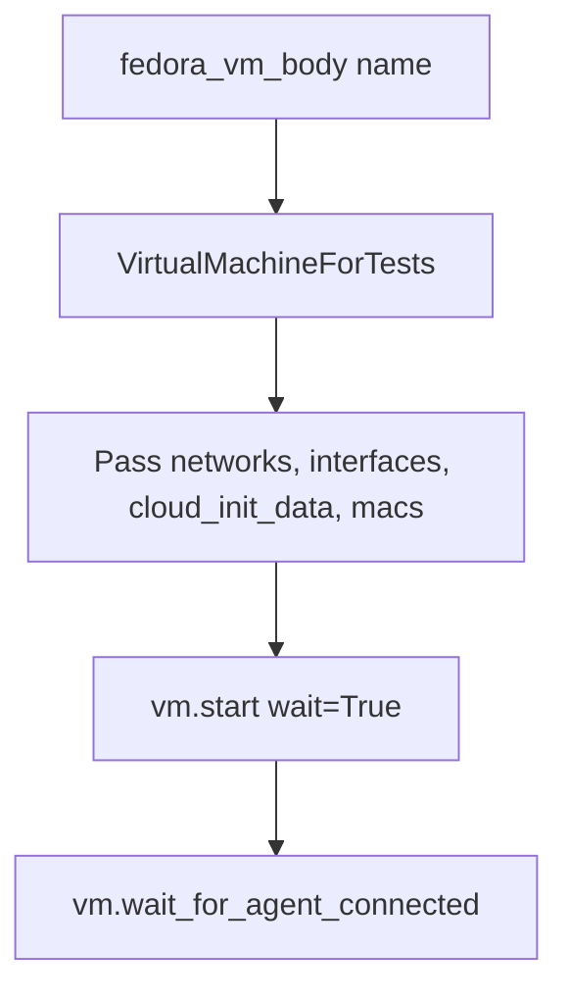

# VM Creation Flows

Three approaches exist, listed from most common to least common.

## VM from Template (dominant pattern)

Used across: `tests/virt/`, `tests/storage/`, `tests/infrastructure/`, `tests/network/` (some)

This is the most common VM creation pattern in the repository. It creates VMs from OpenShift Virtualization templates, using the [golden image pattern](GOLDEN_IMAGE.md) for fast disk provisioning.



Key flow via `vm_instance_from_template()` context manager:
- Takes `request.param` dict with `vm_name`, `template_labels` (OS, workload, flavor)
- Creates `VirtualMachineForTestsFromTemplate` with `data_source` or `data_volume_template`
- Starts VM via `running_vm()` — waits for interfaces + SSH

```python
# Typical conftest pattern
@pytest.fixture(scope="function")
def vm_from_template(
    request,
    unprivileged_client,
    namespace,
    golden_image_data_source_scope_function,
):
    with vm_instance_from_template(
        request=request,
        unprivileged_client=unprivileged_client,
        namespace=namespace,
        data_source=golden_image_data_source_scope_function,
    ) as vm:
        running_vm(vm=vm)
        yield vm
```

## Modern Factory (`libs/vm/factory`)

Used primarily in: network tests (localnet, UDN, l2_bridge, primary_network)



Key pattern:
- `base_vmspec()` creates an empty `VMSpec` dataclass
- Modify `spec.template.spec.domain.devices.interfaces` and `spec.template.spec.networks`
- `fedora_vm()` adds container disk, CPU, memory defaults
- Returns `BaseVirtualMachine` (subclass of ocp_resources VirtualMachine)

## Legacy Pattern (`utilities/virt`)

Used in: older network tests (sriov, migration, bond, macspoof, nmstate, kubemacpool)



Key pattern:
- `fedora_vm_body(name)` generates a dict-based VM body
- `VirtualMachineForTests` wraps it with networks/interfaces as constructor args
- Interfaces specified as dict keys, interface types via `interfaces_types` param

## Choosing Between Them

| Pattern | When to use | Key class |
|---|---|---|
| **VM from Template** | Most tests — virt, storage, infra | `VirtualMachineForTestsFromTemplate` |
| **Modern Factory** | Network tests needing fine-grained spec control | `BaseVirtualMachine` via `fedora_vm()` |
| **Legacy** | Existing older network tests | `VirtualMachineForTests` |

- **New non-network tests**: Use VM from Template with golden images
- **New network tests**: Use the modern factory (`base_vmspec` + `fedora_vm`)
- **Existing tests**: May still use legacy pattern — both work
- The modern factory uses Python dataclasses (`VMSpec`, `Interface`, `Network`) instead of raw dicts
